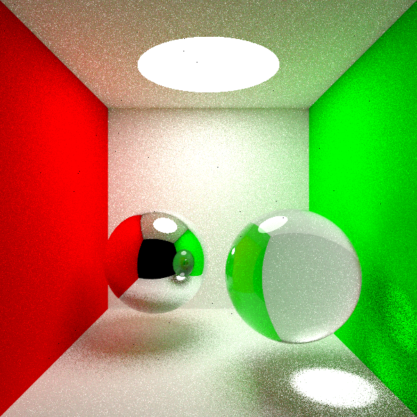

&emsp;&emsp;Hello~，My name is Wuning. This is my **mini RayTracing program**, and is result when I learn PBRT. There are lots of features not surpported. but with learning, more and more features will be supported.

###SUPPORTED FEATURES
 - **Materials:**

1. **Diffuse:** Lambert;
2. **Alpha BRDF:** Pure Reflection, Transperent;
3. **Microfacet:** Blin Microfacet, Cook-Torrence Microfacet.

 - **Primitives：**

1. **Body:** Sphere, Box;
2. **face:** Triangle, Plane, Planer tetragon;

 - **Light:**

1. **Alpha Light:** None;
2. **Face Light:** Disk;
3. **Body Light:** Sphere;

 - **Camera:** PerspectiveCamera, Orthogonal Camera, Pinhole Camera, EnviromentCamera;

###USING METHOD
 - **Sampling Method:**

1. **Important Sampling:** All Material(Exclude Alpha matetial);
2. **MIS(MultipleImportant Sampling):** just Lambert;

 - **Camera Sampling Method:**Stratified Sampling;

 - **Tracing Stop Method:**Russian roulette;

###HOW TO USE
&emsp;&emsp;Run platform is Windows, and there are some **scene files** in the **SceneFile file folder**. You can just run cmdline "miniRT.exe [file name]" on the "CMD" or "PowerShell" to get the Render Scene. 

&emsp;&emsp;For Emample, **run** "mini.exe Scene_CurnellBox.rt", then enter **spp:**"100" and **Depth:** "4", you will get follow result.

